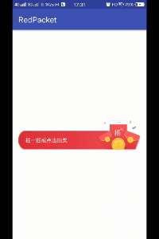

# RedPacket

摇一摇领红包动画效果

#########
Android6.0动态权限
权限分类
普通权限：只需在清单文件中声明即可
危险权限：要求APP主动向用户展示操作所需要的权限，需要用户授权
申请流程说明：
1.判断API版本是否小于23
2.如果小于，不需要动态申请权限，否则检查权限是否已申请
3.如果没有申请，发送申请权限请求，在申请权限前判断是否需要展示权限用处说明

#########
APK体积优化
Android Studio的APK Analyser，是一个APK检测工具，查看内部各项内容所占大小。只需将要分析的
APK文件拖入Android Studio即可。不光是查看APK的大小，还可用来分析APK的目录结构，代码规范。

安装包优化实践
1.删除无用文件
删除无用资源，使用Lint查看未引用的资源。点击Analyze->Inspect Code，然后选中整个项目即可。
在项目编译时期减少被打包到APK中的文件，使用shrinkResources能够在项目编译阶段，删除未被使用
的资源文件，但要minifyEnabled=true。
使用resConfig限定国际化资源文件：
defaultConfig {
    //...

    resConfigs "zh"
}
2.文件优化
静态图片优化：优先使用VectorDrawable图片，webp格式也是不错的选择，Studio支持将PNG或者jgp格式图片转化为webp格式。
动态图片优化：使用GitHub的Android-WebP。
使用Proguard混淆代码。
关于引用三方库：权衡是否需要将其代码全部引入。
插件化来实现动态部署。

#########
崩溃
可以分为两类
JVM异常堆栈信息：使用CrashHandler进行捕获
native代码崩溃日志：系统会在/data/tombstones/目录下保存一份奔溃日志信息，需要一种机制
将native crash现场的日志保存到可以访问的手机目录中，如BreakPad。
针对线上版本，大多数公司没有必要自己实现一个抓取log的平台系统，最快的实现方式是集成第三方SDK.
目前比较成熟的是Bugly.还有XCrash，Sentry.

#########
内存泄漏优化
Activity内存占用大，泄漏防护场景
1.将Context或者View置为static，View默认会持有Context的引用，如果置为static会造成View在方法区中
无法被快速回收，最终导致Activity内存泄漏。
2.未解注册各种Listener，如注册的广播接收者。
3.非静态Handler导致Activity泄漏，一般将Handler置为static，然后在内部持有一个Activity的弱引用。
4.三方库使用Context，尽量使用Context.getApplicationContext()传递。
内存泄漏检测
使用Android Studio并结合MAT来查看发生内存泄漏的具体对象。
LeakCanary:是Square的一个开源库，可以在App运行过程中检测内存泄漏。
JVM如何检测内存泄漏：
WeakReference是弱引用类型，当发生GC时，只被弱引用持有的对象就会被回收。
WeakReference可以传入ReferenceQueue，当对象被回收，会把WeakReference放入队列中。
实现原理：基于WeakReference和ReferenceQueue实现的
1.当Activity需要被回收时就包装到一个WeakReference中，监听Activity的onDestroy.
2.给包装后的WeakReference做一个标记key,并记录在强引用Set中，
3.最后主动触发GC，遍历自定义ReferenceQueue中所有的记录，并根据获取的引用将Set中的记录页删除。
经过上面三步还保留在Set中的就是应当被GC回收，但是发生泄漏的对象。

###########

